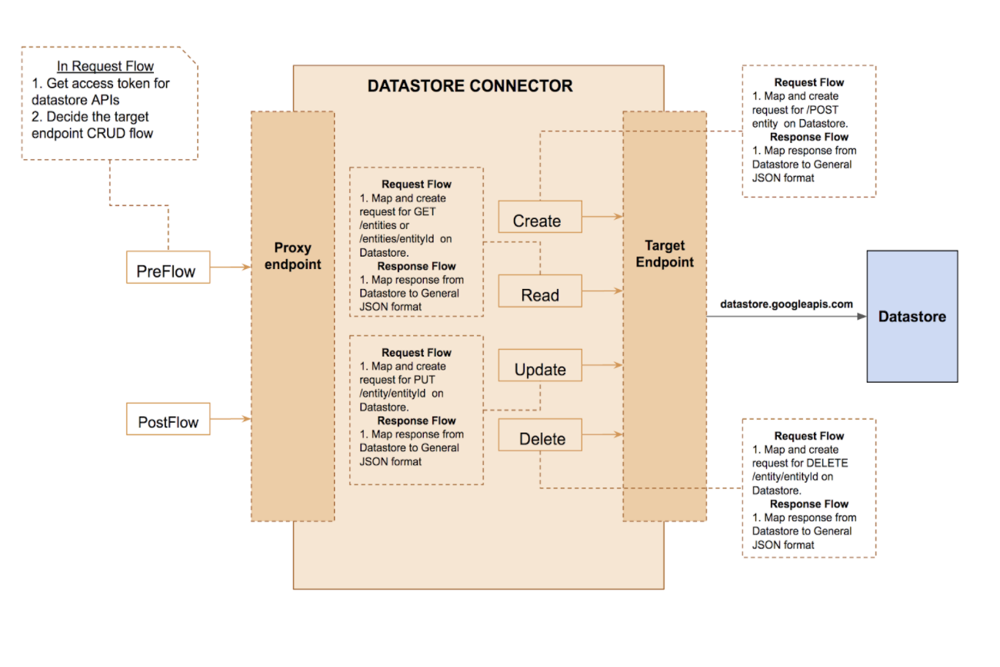

# datastore-connector
This document is organized into the following sections:
1. [Overview](#overview)
2. [Architecture](#architecture)
3. [How to use datastore connector](#how-to-use-datastore-connector?)
4. [Datastore Connector Setup](#datastore-connector-setup)
5. [Restrictions](#restrictions)

### Overview
Datastore connector is available as a proxy bundle which can be easily deployed to an [Apigee Edge](https://docs.apigee.com/api-platform/get-started/what-apigee-edge) organization. It will then allow one to easily use [Google Cloud Datastore](https://cloud.google.com/datastore/docs/concepts/overview) as backend for many use cases using RESTful Endpoints.

### Architecture



### How to use datastore connector?
Google Cloud Datastore is a NoSQL document database. Each collection is known as kind, and data objects in datastore are known as entities.

Note: The api-proxy is secured via api key. Therefore, one needs to provide x-apikey query parameter in all API calls to datastore-connector
The RESTful Operations which can be performed on Google Cloud Datastore using datastore connector are :
##### POST /kind 
It creates new entity(s) for the kind. One can create single entity, or multiple entities in an array at once. 

Samples:
```
POST datastore-connector/person?x-apikey=ascdef
Request: 

  {
      "name": "Peter",
      "dob" : "26-06-1994"
  }

Response:
  {
      "uuid" : "81b07d48-c437-42cb-90fa-cbdc9d187ce2", "name": "Peter",
      "dob" : "26-06-1994"
  }

```

```
POST datastore-connector/person?x-apikey=ascdef
Request: 
[
  {
      "name": "Peter",
      "dob" : "26-06-1994"
  },
  {
     
      "name": "Jessica",
      "dob" : "29-08-1994"
  }
]

  Response:
[
  {
      "name": "Peter",
      "dob" : "26-06-1994",
      "uuid" : "7yb07h48-c437-42cb-90fa-cgkc9d187ce2",
  },
  {
      "name": "Jessica",
      "dob" : "29-08-1994",
      "uuid" : "7yb07h48-c437-42cb-90fa-cgkc9d187ce2"
  }
]
```
##### GET /kind  
Gets all entities of the kind matching query. One can query based on attributes, limit the number of results, perform pagination, and order the results. Pass all attribute queries as a single query parameter "ql". eg: ql = Where name = 'Peter' . The response returned has all matching entities, and the cursor for next set of results.

Samples:
```
Request: 
GET datastore-connector/person?ql=where name = 'Peter'&x-apikey=ascdef

Response:
{ 
  "entities":
  [
    {
        "uuid" : "81b07d48-c437-42cb-90fa-cbdc9d187ce2", 
        "name": "Peter",
        "dob" : "26-06-1994"
    }
  ],
   "cursor" : "kjhgbvdftgyuikjhnbvc"
}
```
```
Request: 
GETdatastore-connector/person?limit=2&ql=Where name = 'Peter'&order=name&cursor=12345jhjgfd&x-apikey=ascdef

Response:
{ 
  "entities"
  [
    {
        "uuid" : "81b07d48-c437-42cb-90fa-cbdc9d187ce2", 
        "name": "Peter",
        "dob" : "26-06-1994"
    }
  ]
}
```
##### GET /kind/entityId 
Get a single entity based on unique Id. The unique Id could be uuid, or name( if present)

Samples:
```
Request: 
GET datastore-connector/person/Peter?x-apikey=ascdef

Response:
{ 
  "entities"
  [
    {
        "uuid" : "81b07d48-c437-42cb-90fa-cbdc9d187ce2", 
        "name": "Peter",
        "dob" : "26-06-1994"
    }
  ]
}
```
```
Request: 
GET datastore-connector/person/81b07d48-c437-42cb-90fa-cbdc9d187ce2?x-apikey=ascdef

Response:
{ 
  "entities"
  [
    {
        "uuid" : "81b07d48-c437-42cb-90fa-cbdc9d187ce2", 
        "name": "Peter",
        "dob" : "26-06-1995"
    }
  ]
}
```

##### PUT /kind/entityId
Updates a single entity based on unique Id. The unique Id could be uuid or name( if present ).

Samples:
```
 Request: 
  PUT datastore-connector/person/Peter?x-apikey=ascdef
  {
      "dob" : "26-06-1995"
  }

  Response:
  {
      "uuid" : "81b07d48-c437-42cb-90fa-cbdc9d187ce2", 
      "name": "Peter",
      "dob" : "26-06-1994"
  }
```
##### DELETE /Kind/entityId 
Deletes a single entity based on unique Id. The unique Id should be uuid

Sample:
```
DELETE /kind/entityId?x-apikey=ascdef
```


### Datastore Connector Setup 
#### Pre-requisites
+ One needs to need to have a [Google Cloud](https://console.cloud.google.com) account, and Datastore instance created for themselves on a Google Cloud project.
+ One needs to create a service account and have available the private key, token-uri, and client email for the service account. 
+ node.js
+ npm
#### Getting Started
Run the following on the command-line
```
$ npm install
$ gulp dsconnectordeploy --env <env>
```
The script will interactively prompt for:
+ Google Cloud project Id
+ Private key of the service account
+ Client email of service account
+ Token uri of service account
+ Edge org
+ Edge username
+ Edge password

Once the deployment of datastore connector is complete, an App called internal_DSappv101 is created on edge. Use its consumer key as "x-apikey" query parameter for all datastore connector calls.

### Restrictions
+ The Google Cloud Datastore does not support “OR” query operations on datastore entities. Eg: SELECT * FROM person where name = ‘abc’ OR name = ‘def’ cannot be executed.
+ The Google Cloud Datastore does not support “!=” query operations on datastore entities. Eg: SELECT * FROM person where age != 20 cannot be executed.
+ For Datastore connector, the query properties cannot be hierarchical.  Eg: GET /person?ql=WHERE Address.country = ‘Germany’ cannot be executed. 
+ The datastore connector has other limitation of [datastore](https://cloud.google.com/datastore/docs/concepts/limits).
